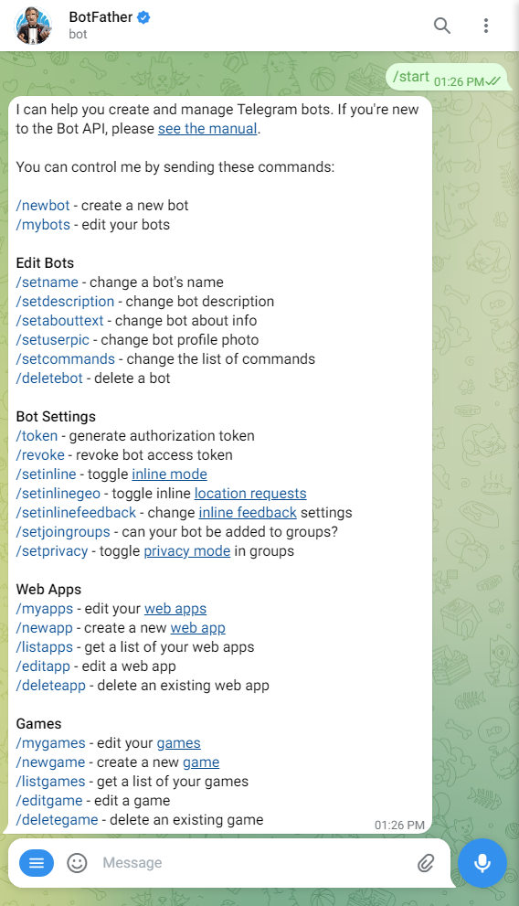

# telegram-notify

send message to TelegramBot chat room


## 建立 Telegram Bot

參考[官方手冊](https://core.telegram.org/bots/features#botfather)。原則上只需要：

1. Telegram 加入聯絡人 `@BotFather`
2. 使用 `/newbot` 指令（如下圖）
	* 過程中會要你輸入機器人顯示名稱以及帳號名稱，然後給你一個 `Token`
	* 請把 Token 記下來
	* 

## 安裝 telegram-notify

在您的 Linux 環境中:

1. sudo apt install jq # 需要安裝 jq
2. curl telegram_notify.sh -o /usr/local/sbin
3. chmod a+x /usr/local/sbin/telegram_notify.sh
4. vim /usr/local/sbin/telegram_notify.sh # 或 nano /usr/local/sbin/telegram_notify.sh
	* 修改 token="123456:ABC-DEF1234ghIkl-zyx57W2v1u123ew11" 取代為你自己的 token

## 使用 telegram-notify

```bash
telegram_notify.sh <訊息>
```

ex: `telegram_notify.sh "Hello World"`

